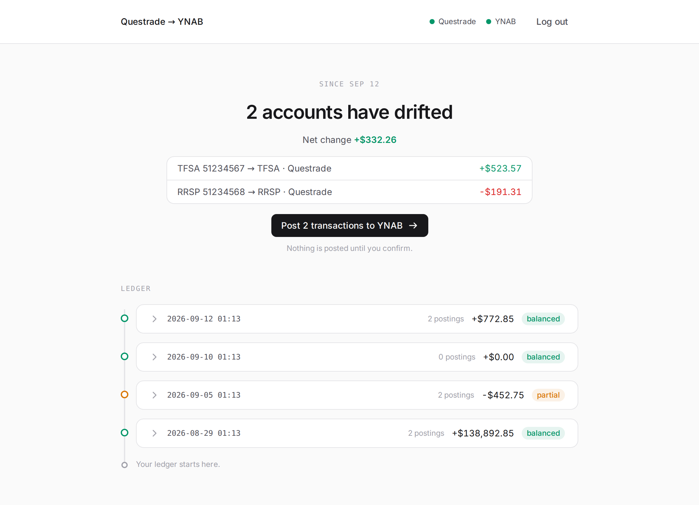
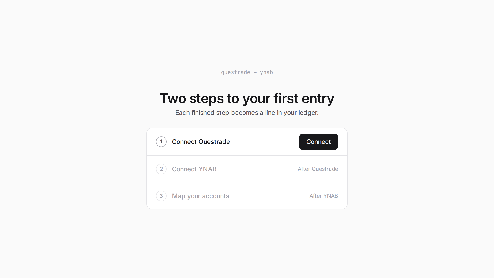
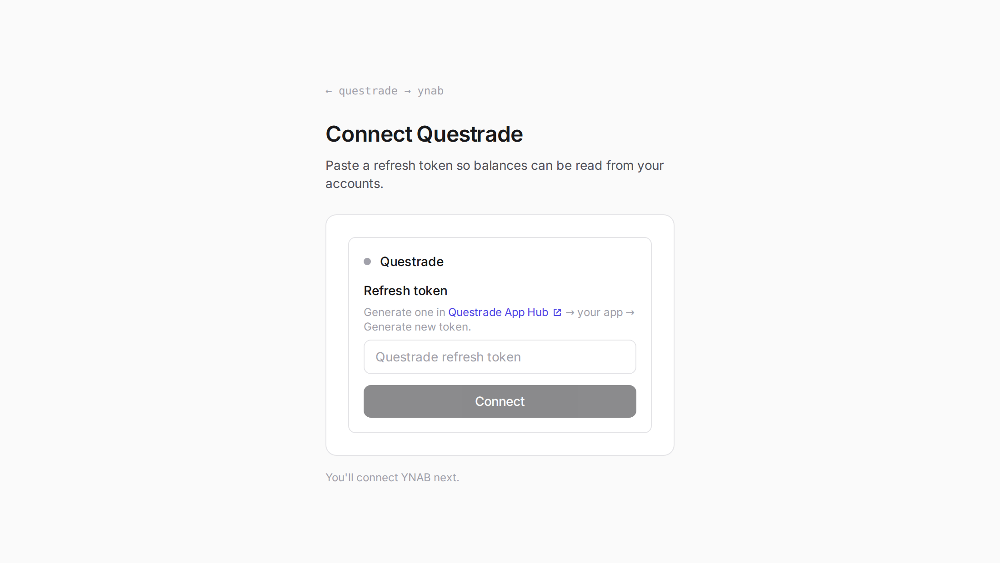
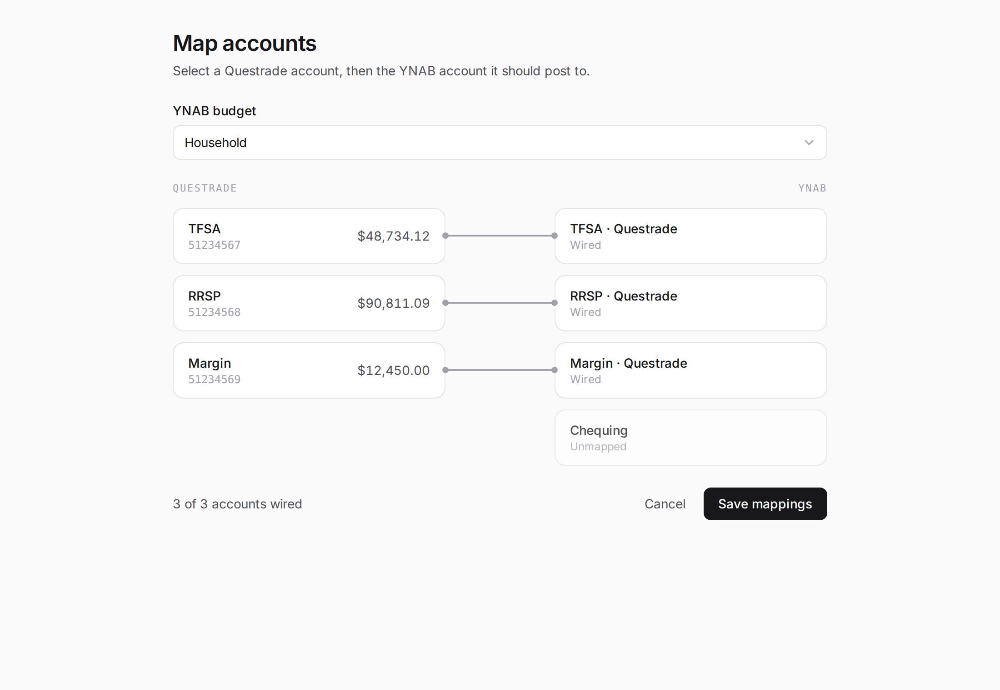
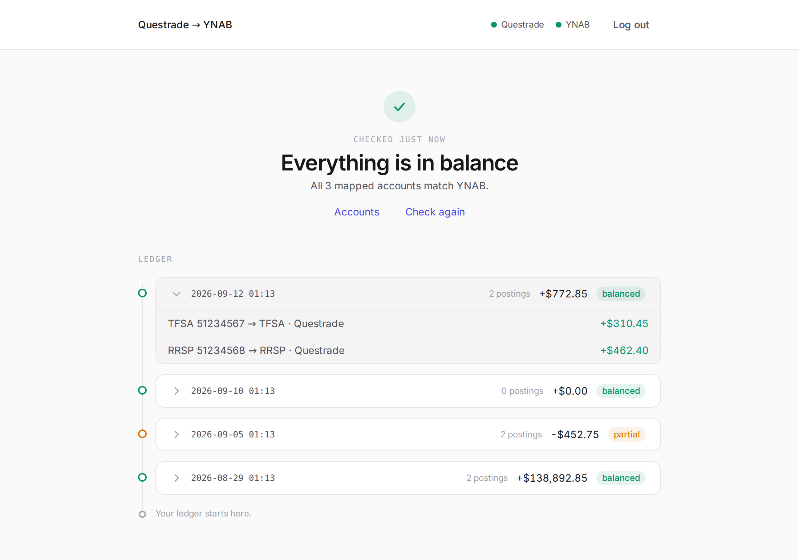
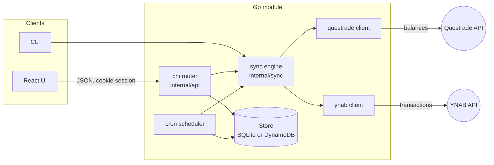

<div align="center">

# Questrade → YNAB

**Keep your YNAB investment accounts in step with Questrade.**

One button posts an adjustment transaction per drifted account.

[](go.mod)
[](web/package.json)
[](infra/)
[](LICENSE)

<picture>
  <source media="(prefers-color-scheme: dark)" srcset="docs/screenshots/drift-dark.png">
  
</picture>

</div>

---

## The problem

YNAB is great at budgets and bad at brokerages. It has no Questrade integration, so
your TFSA, RRSP and margin balances sit in *tracking accounts* that go stale the day
after you type them in. Fixing that by hand means logging into Questrade, reading
three numbers, and entering three manual adjustments. Every week.

This project does that reconciliation for you. It reads live balances from the
Questrade API, compares each one to its mapped YNAB account, and creates one
"Stock Market" transaction per account for exactly the difference. Your YNAB net
worth reports stay honest, and your transaction history shows *when* the market
moved your money.

## Three ways to run it

The Go module is shared by all three. Same Questrade and YNAB clients, same sync engine.

| | What it is | When to use it |
|---|---|---|
| **CLI** | A single binary with `auth`, `mapping` and `sync` commands. Config lives in `~/.questrade-ynab`. | You want a cron job on a machine you own, or you like terminals. |
| **Web app, local** | Go API (chi) plus a React/Vite UI. SQLite on disk. One `make dev`. | You want the ledger UI and a scheduled sync running on your own box. |
| **Web app, AWS** | The same app on Lambda + CloudFront + DynamoDB, deployed with CDK. | You want it always on, at your own domain, with nothing to maintain. |

## The web app

The interface is built around a single idea: a **ledger**. Every sync is an entry.
Every entry lists the postings it made. The only decision you make is whether to
post what drifted.

### 1. Connect

The first screen is a three-step checklist. Questrade personal apps don't support
the OAuth redirect flow, so step one asks you to paste a refresh token from the
Questrade App Hub. Step two is a normal OAuth handoff to YNAB.

<p align="center">
<picture>
  <source media="(prefers-color-scheme: dark)" srcset="docs/screenshots/landing-dark.png">
  
</picture>
</p>

<p align="center">
<picture>
  <source media="(prefers-color-scheme: dark)" srcset="docs/screenshots/connect-dark.png">
  
</picture>
</p>

### 2. Map accounts

Wire each Questrade account to the YNAB tracking account it should post to. A YNAB
account can only receive one wire, so picking it in one row unpicks it in another.

<p align="center">
<picture>
  <source media="(prefers-color-scheme: dark)" srcset="docs/screenshots/mappings-dark.png">
  
</picture>
</p>

### 3. Post what drifted

The dashboard runs a dry-run sync on load, so it opens already knowing the answer.
If anything drifted you see each account, the delta, and one button. When nothing
drifted you get a checkmark and a ledger you can expand entry by entry.

<p align="center">
<picture>
  <source media="(prefers-color-scheme: dark)" srcset="docs/screenshots/balanced-dark.png">
  
</picture>
</p>

The UI follows your system theme. Every screenshot above swaps to its dark version
if your GitHub theme is dark.

## The CLI

Three commands. Config is JSON in `~/.questrade-ynab/`.

### Install

Grab a prebuilt binary from the [Releases page](https://github.com/brymastr/questrade-ynab/releases/latest).
There's one for Linux, macOS and Windows on both amd64 and arm64.

```sh
# Linux / macOS example
tar -xzf questrade-ynab_*_$(uname -s | tr A-Z a-z)_$(uname -m | sed 's/x86_64/amd64/;s/aarch64/arm64/').tar.gz
sudo mv questrade-ynab /usr/local/bin/
questrade-ynab --version
```

Or, if you have Go installed:

```sh
go install github.com/brymastr/questrade-ynab@latest
```

### Use

```sh
questrade-ynab auth set        # paste Questrade refresh token, YNAB token, budget ID
questrade-ynab mapping set     # interactive: pick a Questrade account, pick its YNAB account
questrade-ynab sync --dry-run  # preview
questrade-ynab sync            # preview, confirm, post
```

A sync looks like this:

```text
$ questrade-ynab sync
Fetching Questrade accounts...
Fetching YNAB accounts...

Preparing transactions...
Planned transactions:
  51234567 (TFSA) → TFSA · Questrade: $48210.55 → $48734.12 (delta: $523.57)
  51234568 (RRSP) → RRSP · Questrade: $91002.40 → $90811.09 (delta: $-191.31)

Do you want to create these transactions? (y/N): y
✓ Created transaction for TFSA · Questrade: $523.57
✓ Created transaction for RRSP · Questrade: $-191.31
```

| Command | What it does |
|---|---|
| `auth set` | Prompt for tokens and budget ID, write `config.json`. |
| `auth login` | Validate the cached Questrade access token, refresh it, or prompt for a new refresh token. |
| `auth show` | Print the current config. |
| `mapping list` | List Questrade and YNAB accounts with balances, show current mappings, dump both lists to JSON for lookup. |
| `mapping set` | Interactive mapping. Writes `mappings.json`, a flat `{questrade_number: ynab_account_id}` object. |
| `sync` | Fetch, diff, preview, ask, post. `--dry-run` stops after the preview. |
| `serve` | Start the HTTP API and the in-process sync scheduler. This is what `make dev` runs. |

Releases are cut by pushing a tag. GitHub Actions runs [GoReleaser](.goreleaser.yaml),
which cross-compiles every target and attaches the archives and checksums to a GitHub
Release.

```sh
git tag v0.1.0 && git push origin v0.1.0
```

Questrade refresh tokens are single-use. Every command that talks to Questrade
persists the rotated token back to config, so you only paste one once.

## How it works



**The sync algorithm** is small and lives in [`internal/sync`](internal/sync/sync.go):

1. Refresh the Questrade access token if it has expired.
2. Fetch every Questrade account with its combined balance. Take `TotalEquity`.
3. Fetch the YNAB accounts for every budget that appears in a mapping. YNAB stores
   balances in milliunits, so divide by 1000.
4. For each mapping, `delta = questrade_balance - ynab_balance`. Skip zeros.
5. Unless dry-run, create one cleared, approved transaction per non-zero delta.
   Payee "Stock Market", memo "Questrade sync", dated today.
6. Return a result with a line per account, so the caller can render a preview or
   store a history entry.

**The API** is a dozen routes behind a JWT cookie session:

| Method | Route | Purpose |
|---|---|---|
| `POST` | `/auth/questrade` | Exchange a pasted refresh token; creates the session. |
| `GET` | `/auth/ynab`, `/auth/ynab/callback` | YNAB OAuth. |
| `POST` | `/auth/logout` | Clear the session. |
| `GET` | `/api/me` | Connection status for both services. |
| `GET` | `/api/accounts/questrade`, `/api/budgets/ynab`, `/api/accounts/ynab` | Account lists for the mapping screen. |
| `GET` `PUT` `DELETE` | `/api/mappings` | Read, replace, or remove mappings. |
| `POST` | `/api/sync/run?dry_run=true` | Run a sync. Dry-run is what the dashboard calls on load. |
| `GET` `PUT` | `/api/sync/schedule` | Per-user cron expression for automatic syncs. |
| `GET` | `/api/sync/history` | The ledger. |

**Storage** is one interface with two backends. Locally it's SQLite via the pure-Go
`modernc` driver, so there's no CGO and the same binary cross-compiles for Lambda.
On AWS it's a single DynamoDB table. Tokens for both services are stored per user.

**The scheduler** loads every enabled cron expression at startup and runs the sync
engine on schedule. In Lambda it's swapped for a no-op, since a long-lived cron
doesn't fit a function that only exists while handling a request.

## Run it locally

Requirements: Go 1.25+, Node 18+.

```sh
cp .env.example .env
# set QUESTRADE_CLIENT_ID/SECRET and YNAB_CLIENT_ID/SECRET

make install   # npm install in web/
make dev       # Go API on :8080 with live reload, Vite on :5173
```

Register `http://localhost:5173/auth/ynab/callback` as a redirect URI in your
[YNAB developer settings](https://app.ynab.com/settings/developer), then open
http://localhost:5173. Data lands in `./data/app.db`. No other services are needed.

## Deploy to AWS

Each environment is its own CDK stack with its own domain, table, Lambda and secret.

```sh
cd infra && npm install && npx cdk bootstrap aws://<account-id>/us-east-1 && cd ..
cp infra/.env.example infra/.env.dev     # DOMAIN_NAME, HOSTED_ZONE_NAME

make deploy                # dev
APP_ENV=prod make deploy   # prod
```

`make deploy` cross-compiles the arm64 Lambda, builds the SPA, and runs
`cdk deploy`, which uploads the bundle to S3 and invalidates CloudFront. After the
first deploy, fill the four OAuth values into the generated Secrets Manager secret
and register `https://<your-domain>/auth/ynab/callback` with YNAB. The
[infra README](infra/README.md) covers secrets, DNS, and teardown in detail.

## Repository layout

```
.
├── main.go            Entry point. Runs the Lambda adapter or the cobra CLI.
├── cmd/               CLI commands: auth, mapping, sync, serve
├── internal/
│   ├── api/           chi router, handlers, session middleware
│   ├── auth/          JWT sessions, OAuth helpers
│   ├── db/            Store interface, SQLite and DynamoDB implementations
│   ├── questrade/     Questrade API client with token refresh
│   ├── ynab/          YNAB API client
│   ├── scheduler/     Per-user cron jobs
│   └── sync/          The reconciliation engine shared by everything above
├── web/               React + Vite + Tailwind SPA
├── infra/             AWS CDK stack (Lambda, CloudFront, S3, DynamoDB, Secrets Manager)
├── bruno/             Bruno collection for poking the Questrade API
└── docs/screenshots/  What you saw above
```

## Good to know

- Questrade refresh tokens expire after 7 days of disuse and rotate on every use.
  The app and CLI both persist the rotated token.
- YNAB amounts are milliunits. `$12.34` is `12340`.
- Transactions are posted as cleared and approved so they never land in your
  "to review" pile.
- Nothing is ever deleted from YNAB. A wrong sync is undone by deleting the
  transaction in YNAB and running the sync again.

## License

[MIT](LICENSE)
